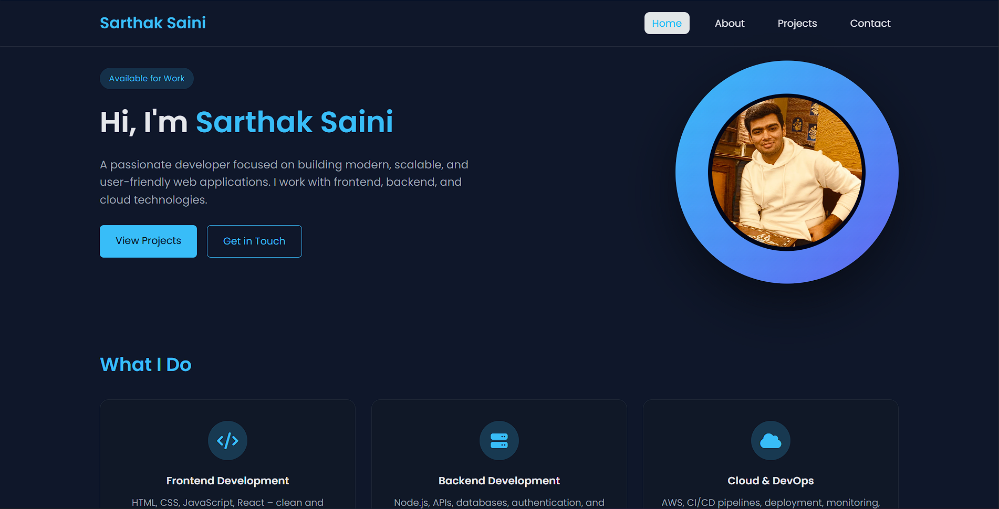
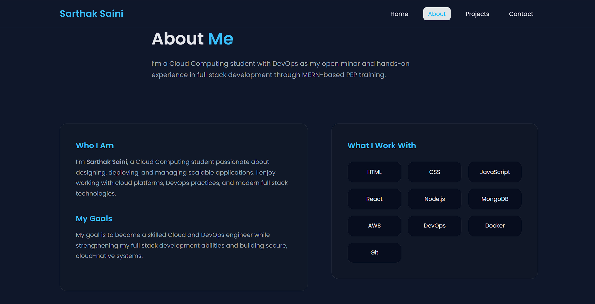
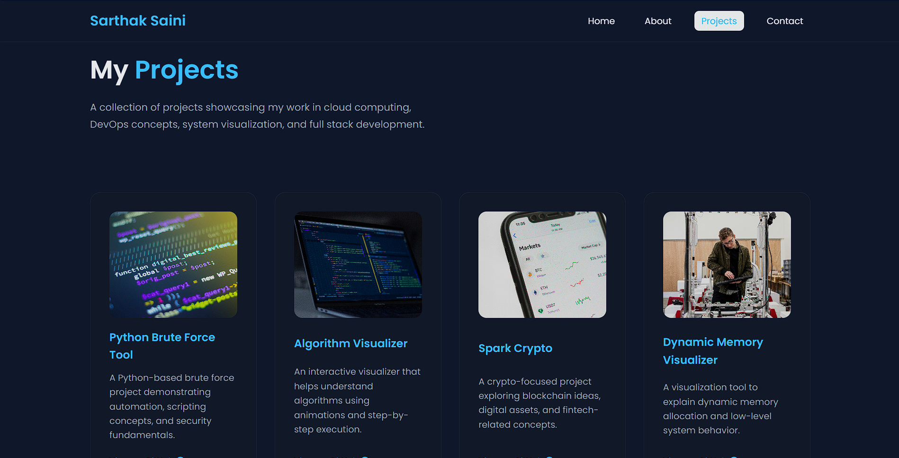
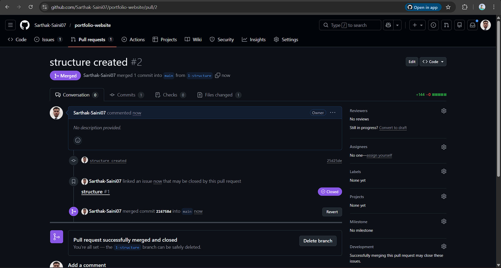
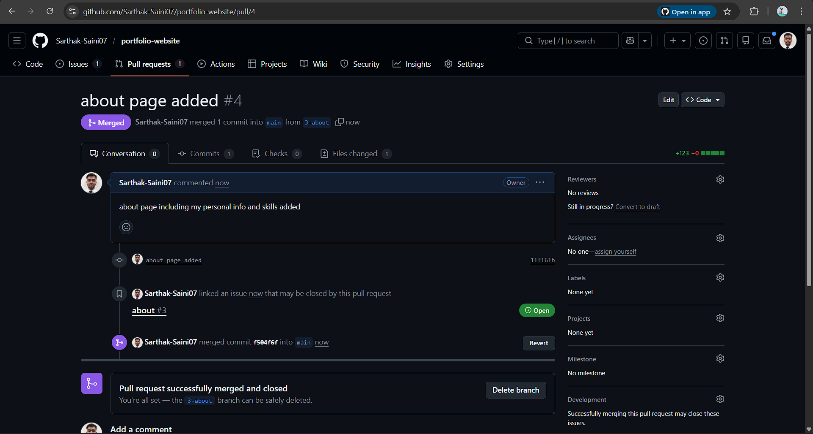
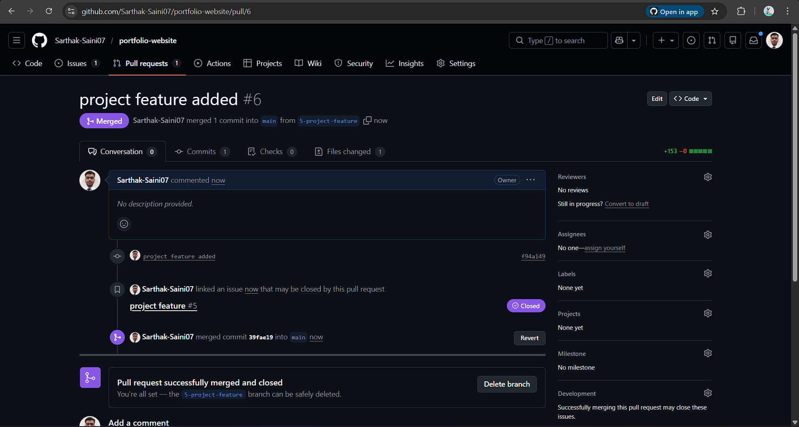
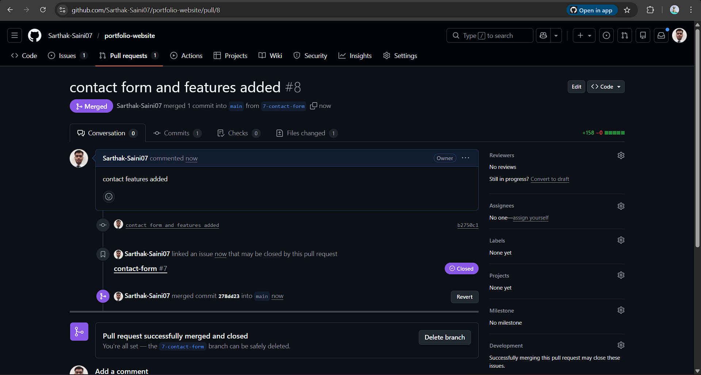



# 🌐 Sarthak Saini – Personal Portfolio


A clean, modern, and fully responsive **personal portfolio website** built using **pure HTML, CSS, and JavaScript**.  
This project was developed as a **mini-project** to demonstrate frontend development skills, responsive design, and proper GitHub workflow practices.

🔗 **Repository:** https://github.com/Sarthak-Saini07/portfolio-website  
🌍 **Live Demo:** https://sarthak-saini07.github.io/portfolio-website/

## 📋 Project Description

This is my personal portfolio website where I showcase my background, skills, and projects as a **Cloud Computing student** with **DevOps as an open minor** and **MERN stack training**.

The website is built completely from scratch using core web technologies, focusing on:

- Clean UI design  
- Dark theme aesthetics  
- Responsive layouts  
- Smooth user experience  
- Maintainable and well-structured code  
  


## 🛠️ Tech Stack

### **Frontend**

- **HTML5**  
  - Semantic markup and structure  

- **CSS3**  
  - CSS Variables for theming  
  - Flexbox for flexible layouts  
  - CSS Grid for complex layouts  
  - Media Queries for responsiveness  
  - Transitions & hover effects  

- **JavaScript**  
  - Client-side form validation  
  - Interactive UI behavior  

### **Tools & Libraries**

- **Font Awesome** – Icons  
- **Google Fonts (Poppins)**  
- **Git & GitHub** – Version control  
- **GitHub Pages** – Deployment 

## ✨ Features

### **Pages**

- 🏠 **Home**  
  - Hero section with introduction, profile image, and skills overview  

- 👤 **About**  
  - Background, interests, and technologies I work with  

- 💼 **Projects**  
  - Project showcase with GitHub repository links  

- 📧 **Contact**  
  - Contact form with JavaScript validation  

### **Key Highlights**

- Fully responsive design (Mobile, Tablet, Desktop)  
- Sticky glassmorphism navigation bar  
- Dark theme using CSS variables  
- Flexbox and Grid based layouts  
- Skill cards with icons  
- Project cards with images and links  
- Contact form with custom validation messages  
- Smooth hover effects and transitions  
- Semantic HTML structure  
- Cross-browser compatible  

📂 Project Structure

```text
portfolio-website/
├── images/
│   ├── index.png
│   ├── about.png
│   ├── projects.png
│   └── contact.png
│
├── screenshots/
│   ├── s1.png
│   ├── s2.png
│   ├── s3.png
│   └── s4.png
│
├── index.html
├── about.html
├── projects.html
├── contact.html
├── style.css
├── script.js
├── profile.jpg
└── README.md

## 🎨 CSS Concepts Used

| **Concept**        | **Implementation**                          |
|--------------------|----------------------------------------------|
| Box Model          | Padding, margin, border                     |
| Flexbox            | Navbar, hero layout, card layouts           |
| CSS Grid           | Skills section, projects layout, footer     |
| Positioning        | Sticky navbar, absolute hero image          |
| Media Queries      | Responsive layouts                          |
| Transitions        | Hover effects, button animations            |
| Variables          | Theme colors using `:root`                  |
| Responsive Units   | `rem`, `%`, `vw`, `vh`                      |


## 🔧 Installation & Setup

### Clone the repository

```bash
git clone https://github.com/Sarthak-Saini07/portfolio-website.git
cd portfolio-website
```
## 📸 Screenshots

### 🏠 Home Page


### 👤 About Page


### 💼 Projects Page


### 📧 Contact Page


## 📚 What I Learned

- Writing **semantic and accessible HTML**  
- Creating responsive layouts using **Flexbox** & **CSS Grid**  
- Designing **dark-mode UI** using CSS variables  
- Adding interactivity using **JavaScript**  
- Implementing **client-side form validation**  
- Managing projects with **Git branches and pull requests**  
- Deploying static websites using **GitHub Pages**  
- Organizing **CSS and JavaScript** for scalability and maintainability  

## 📝 Git Workflow

### Commits Made

- Initial project structure setup  
- Add sticky glassmorphism navbar  
- Build hero and skills section  
- Create About and Projects pages  
- Add contact form with validation  
- Implement responsive design  
- UI polish and documentation 

## 📸 Screenshots for pull requests







  
## 🚀 Future Enhancements

- Light / Dark mode toggle  
- Backend integration for contact form  
- Scroll-based animations  
- SEO optimization  
- Accessibility improvements  
- Downloadable resume section  
  
## 👨‍💻 Author

**Sarthak Saini**  
Cloud Computing Student | DevOps (Open Minor) | MERN Stack Trainee  

🔗 GitHub: https://github.com/Sarthak-Saini07  


## 📄 License

This project is **open-source** and intended for **educational purposes**.


## 🙏 Acknowledgments

- Font Awesome for icon support  
- Web development community for inspiration  

- Open-source documentation and learning resources  
